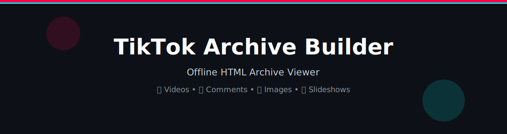
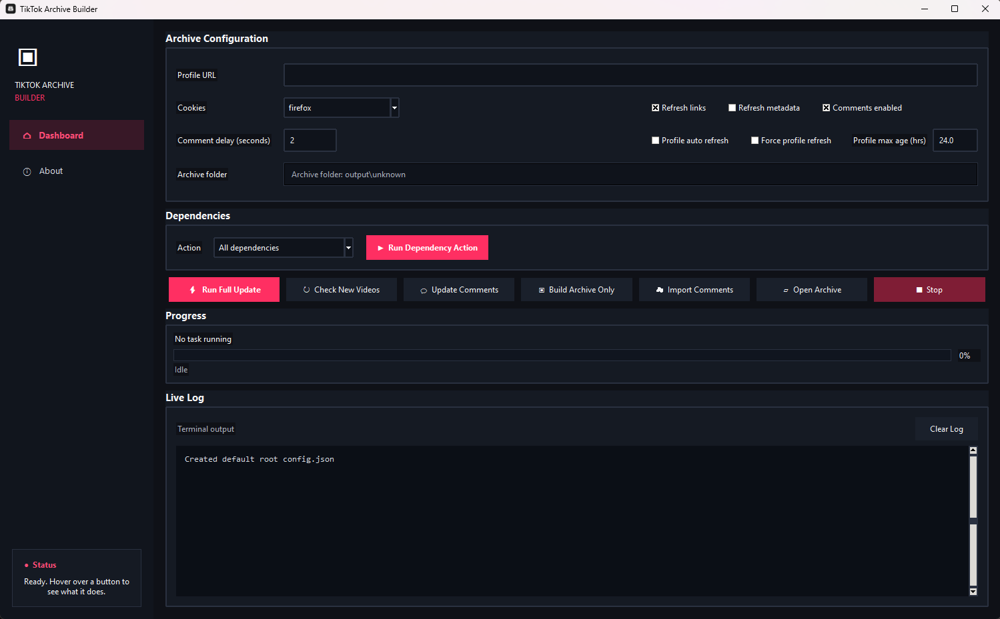

# TikTok Archive Builder (GUI)

A local tool to download TikTok content and build an offline archive you can browse in your browser.

---

## What It Does

* Downloads TikTok videos
* Saves metadata and thumbnails
* Scrapes comments (including images and stickers)
* Supports slideshow/photo posts
* Tracks deleted videos
* Builds a full offline HTML archive

---

## Features

### Archiving

* Download videos with yt-dlp
* Save metadata and thumbnails

### Comments

* Scrapes all comments, including images and stickers
* Merges and deduplicates data

### Slideshows

* Detects and downloads all images from photo posts
* Filters out unrelated images

### Tracking

* Tracks deleted videos
* Avoids re-downloading existing files

---

## HTML Archive

The tool builds a **local .html archive** to view everything.

### What You Can Do

* Play videos
* View comments and replies
* See comment images
* View slideshow posts as galleries

### Features

* Filter:

  * Videos
  * Slideshows
  * Posts with images
* Sort:

  * Newest / Oldest
* Toggle comments and replies
* Works fully offline

---

## Screenshots

### GUI



---

## Project Structure

```
output/
  username/
    links.txt
    deletedvids.txt
    archive_out/
      index.html
      videos/
      thumbs/
      comments/
      comment_images/
      slideshows/
```

---

## How to Use

Install dependencies:

```
pip install -r requirements.txt
```

Run:

```
python gui_integrated_output.py
```

---

## Build EXE

```
build_integrated_output_gui_spec_playwright_bundled.bat
```

---

## Credits

* yt-dlp
  https://github.com/yt-dlp/yt-dlp

* TikTok Comment Scraper
  https://github.com/RomySaputraSihananda/tiktok-comment-scrapper

---

## Disclaimer

For personal use only. Respect content ownership.
